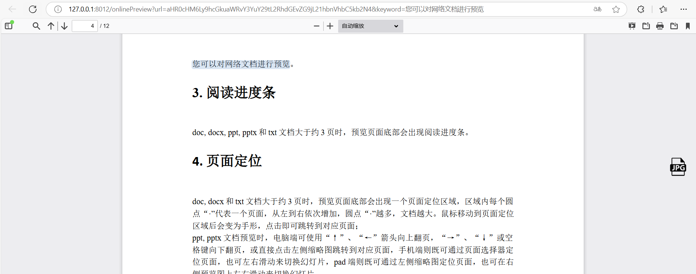

# kkFileViewHighlight 🔍
演示地址：http://106.75.176.60:8012/index （请勿上传重要文件，服务器会定期清理）
## ✨ 关键词高亮定位功能
支持在 doc、docx、pdf、excel、txt 等格式文件中实现关键词高亮定位功能。只需在预览 URL 后添加 keyword 参数即可，多个关键词可用空格分隔。

### 📝 使用方法
参数说明：
- `url`: 您的在线文档地址
- `keyword`: 需要高亮的关键词

### 💻 示例代码
```javascript
// 设置预览文件地址
var url = 'http://127.0.0.1:8080/file/test.txt';

// 设置高亮关键词（多个关键词用空格分隔）
var keyword = '关键词1 关键词2 关键词3';

// 打开预览窗口
window.open('http://127.0.0.1:8012/onlinePreview?url=' + 
    encodeURIComponent(Base64.encode(url)) + 
    '&keyword=' + encodeURIComponent(keyword));
```

### 🖼️ 效果展示


## 🙏 致谢
本项目基于 [kkFileView](https://kkview.cn/) 开发，特此感谢！

## 📚 更多信息
详细文档请参考：[kkFileView 详细文档](README.cn-origin.md)
